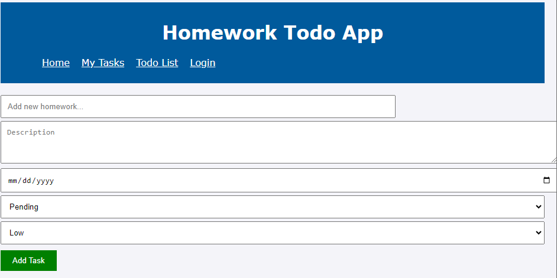
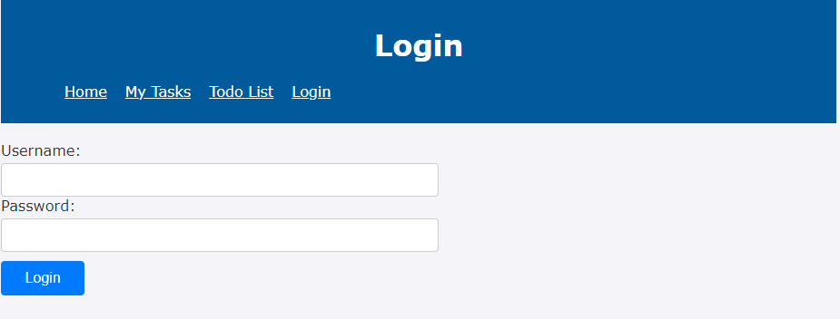
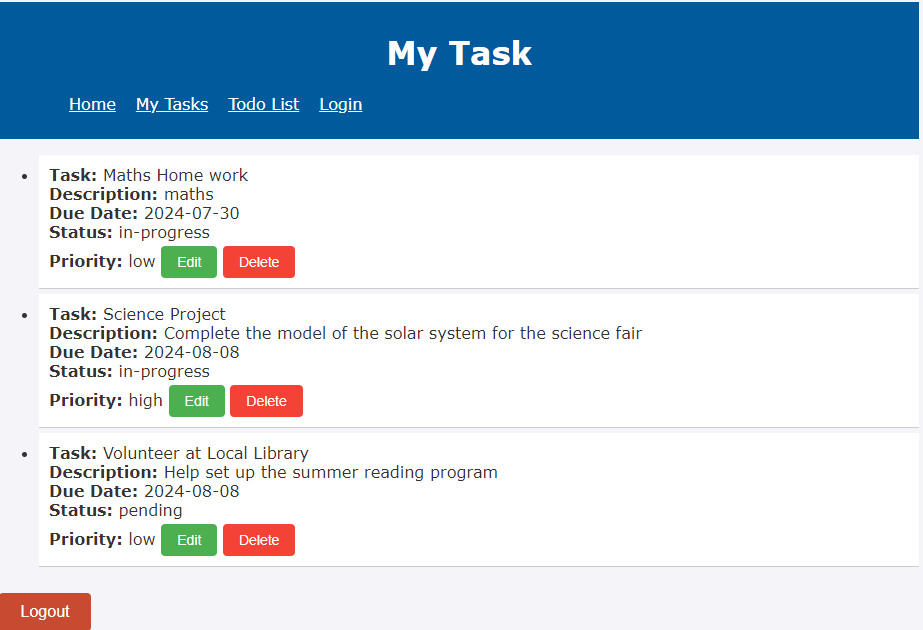

# Todo App

This is a Todo App designed to help middle school students manage their homework and projects. The app allows users to create, read, update, and delete tasks. It also provides a login functionality and displays tasks in a user-friendly interface.

## Table of Contents

- [Features](#features)
- [Technologies Used](#technologies-used)
- [Installation](#installation)
- [Usage](#usage)
- [Project Structure](#project-structure)
- [API Endpoints](#api-endpoints)
- [Screenshots](#screenshots)
- [License](#license)

## Features

- User Authentication
- Create, Read, Update, and Delete (CRUD) tasks
- Task prioritization and status management
- Responsive design
- Persistent data storage

## Technologies Used

- Frontend: HTML, CSS, JavaScript
- Backend: Node.js, Express.js
- Database: MongoDB
- Authentication: bcrypt
- Testing: Jest

## Installation

1. Clone the repository:
   ```bash
   git clone https://github.com/Hiwotgebre/Gebre_Hiwot_TodoApp_Capstone
   cd todo-app
2. Install the dependencies:
    npm install
3. Set up environment variables
    MONGO_URI=your_mongo_uri
4. Startthe server
    npm start

## Usage

1. Open your browser and navigate to http://localhost:3000.
2. Register a new user or log in with an existing account.
3. Add, edit, delete, and manage your tasks.

## Project Structure

├── css
│   ├── login.css
│   ├── main.css
│   ├── task-display.css
│   ├── todo-list-display.css
├── js
│   ├── login.js
│   ├── main.js
│   ├── task-display.js
│   ├── todo-list-display.js
├── models
│   ├── Task.js
│   ├── User.js
├── routes
│   ├── userRoutes.js
├── html
│   ├── index.html
│   ├── login.html
│   ├── task-display.html
│   ├── todo-list-display.html
├── .gitignore
├── conn.js
├── db.js
├── package.json
├── README.md

## API Endpoints

. User Routes
    . POST /signup - Register a new user
    . POST /login - Authenticate a user

. Task Routes
    . GET /tasks - Get all tasks
    . POST /tasks - Create a new task
    . PUT /tasks/:id - Update a task
    . DELETE /tasks/:id - Delete a task

## ScreenShots

1. Home/Add task Page
    

2. Login Page
    

3. Task List Page
    
